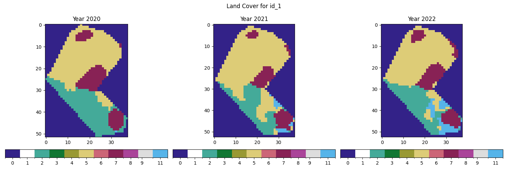
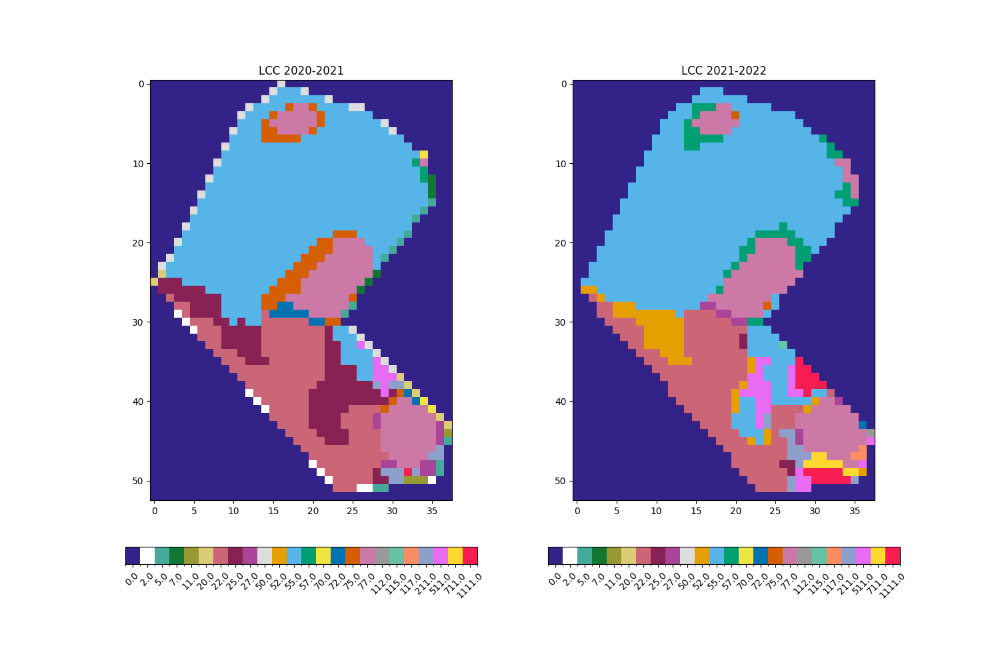
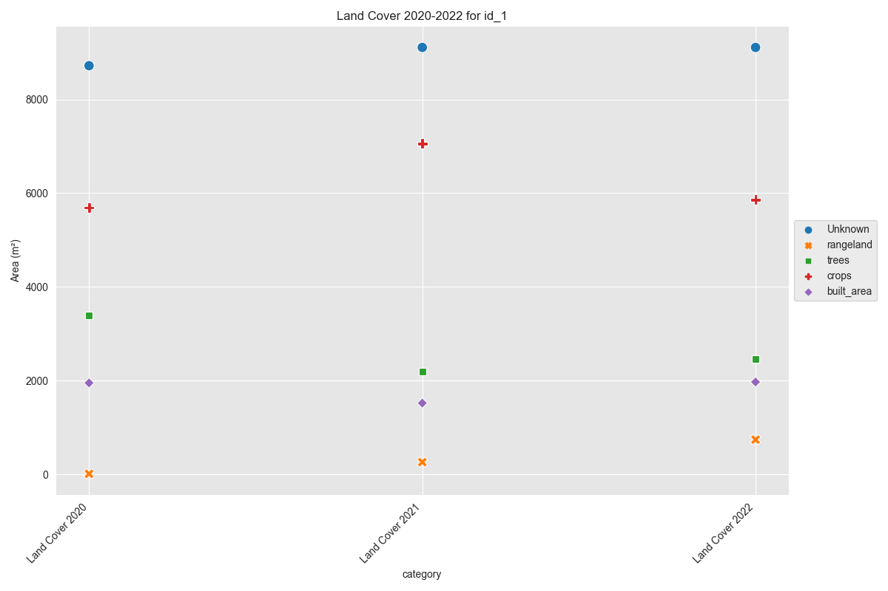
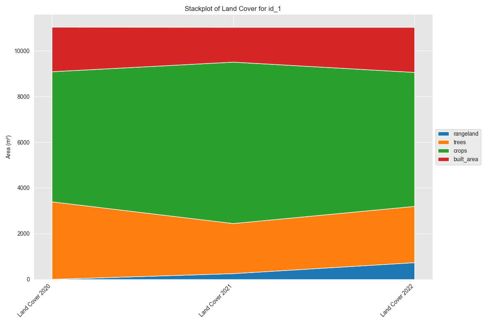

# natcap_interview

[](https://kedro.org)

## Overview

This is an interview assignment for NatCap Senior Scientist. The project has been generated using Kedro (version 0.19.11) and has Kedro-Viz set up by default.

Some key features and folders to note:

• Jupyter notebooks that demonstrate Part 1 (LCC analysis on a single area) and python script for Part 2 (batch processing).  
• Data folder structure adhering to the Kedro "Data Engineering Convention."  
• Configuration options for local and base settings.  

This README provides detailed instructions on how to get started, install dependencies, and work with notebooks.

---

## Project Structure

A brief overview of the file/folder organization:

• <strong>conf/</strong>  
  – <strong>base/</strong>: Base configurations (e.g., catalog.yml, parameters.yml).  
  – <strong>local/</strong>: Local configurations for credentials and user-specific settings (excluded from version control).  

• <strong>data/</strong>  
  – <strong>01_raw/</strong>: Raw input data (e.g., raster files).  
  – <strong>02_intermediate/</strong>: Cleaned/intermediately processed data.  
  – <strong>07_model_output/</strong>: Model or analysis outputs ready for further inspection.  
  – <strong>07_model_output/Part_2/Concat</strong>: Final data output for concatenated results for all sites.
  – Other data-layer folders exist but are not used in the current iteration (e.g., 03_primary, 04_feature, etc.).  

• <strong>docs/</strong>  
  – Generated figures, or logs may also be written here by scripts and notebooks (e.g., <code>Part_1/</code> and <code>Part_2/</code> directories).  

• <strong>notebooks/</strong>  
  – Contains Jupyter notebooks demonstrating specific analyses such as "Part1_LCC.ipynb," which shows land cover change workflows using raster and vector data.  

• <strong>src/</strong>  
  – <strong>natcap_interview/</strong>: Main Python source code for this Kedro project.  
    – <code>__init__.py</code>: Defines the package version.  
    – <code>__main__.py</code>: Makes the package runnable with <code>python -m natcap_interview</code>.  
    – <code>Part_2.py</code>: Demonstrates a batch-processing approach to land cover change.  

---

## How to Install Dependencies

Project requirements are stored in:

• <code>requirements.txt</code> (for pip installs), and  
• <code>pyproject.toml</code> (for an overview of dependencies in a more modern format).

To install using <code>requirements.txt</code>, simply run:

```
pip install -r requirements.txt
```

Or install using UV, which is what I used for the virtual environment:

```
uv sync --frozen
```

---

## Running the analysis
**Part_1: run the [Part1_LCC.ipynb](./notebooks/Part1_LCC.ipynb) in /notebooks**\
**Part_2: run the [Part_2.py](./src/natcap_interview/Part_2.py) using**

```
uv run src/natcap_interview/Part_2.py
```

---

## Results

### Part 1

id_1





### Part 2

Total Land Cover through time


---

## Additional Notes on Land Cover Change (LCC) Notebooks and codes

• <strong>Part1_LCC.ipynb</strong>: Demonstrates how to load raster data (land cover years 2020, 2021, 2022), clip to an area of interest (AOI), resample if needed (not working), and compute categorical changes through time.  
• <strong>Part_2.py</strong> / <strong>Part_2</strong> scripts: Illustrates a batch approach for multiple AOIs or multiple sets of time-series raster data.

Only Part_2.py writes logs, plots, or output CSVs to designated folders <code>docs/Part_2</code> or <code>data/</code> subfolders, as configured within the scripts.
